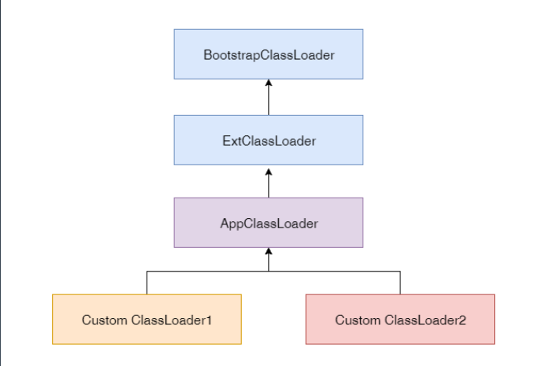

**必做1：**自定义一个 Classloader，加载一个 Hello.xlass 文件，执行 hello 方法，此文件内
容是一个 Hello.class 文件所有字节（x=255-x）处理后的文件。文件群里提供。

```java
package bytecode;

import java.io.ByteArrayOutputStream;
import java.io.File;
import java.io.FileInputStream;
import java.lang.reflect.InvocationTargetException;

public class HelloXlassLoader extends ClassLoader{

    public static void main(String[] args) {
        try {
            Class cl = new HelloXlassLoader().findClass("Hello");
            // 调用非静态方法的时候，需要传入已初始化的实体
            cl.getMethod("hello").invoke(cl.newInstance());
        }catch (ClassNotFoundException e) {
            e.printStackTrace();
        } catch (NoSuchMethodException e) {
            e.printStackTrace();
        } catch (IllegalAccessException e) {
            e.printStackTrace();
        } catch (InvocationTargetException e) {
            e.printStackTrace();
        } catch (InstantiationException e) {
            e.printStackTrace();
        }
    }

    /**
     * 字节转换 x = 255 - x
     * 然后再用装载该字节码
     * @param name
     * @return
     * @throws ClassNotFoundException
     */
    @Override
    protected Class<?> findClass(String name) throws ClassNotFoundException {
        // 绝对路径的值需要根据文件实际存放位置进行修改
        byte[] bytes = fileConvertToByteArray(new File("E:\\workspace\\ideaWorkSpace\\Practice\\src\\main\\resources\\Hello.xlass"));
        for (int i = 0; i < bytes.length; i++) {
            bytes[i] = (byte) (255 - bytes[i]);
        }
        return defineClass(name,bytes,0,bytes.length);
    }

    /**
     * 将指定文件转换成byte数组
     * @param file 待转换成byte数组的文件
     * @return
     */
    private byte[] fileConvertToByteArray(File file) {
        byte[] data = null;
        try{
            // 文件输入流
            FileInputStream fis = new FileInputStream(file);
            // 字节输出流
            ByteArrayOutputStream baos = new ByteArrayOutputStream();
            int len;
            byte[] buffer = new byte[1024];
            while ((len = fis.read(buffer)) != -1) {
                baos.write(buffer,0,len);
            }
            data = baos.toByteArray();

            fis.close();
            baos.close();
        }catch (Exception e) {
            e.printStackTrace();
        }

        return data;
    }

}

````

**必做2：**画一张图，展示 Xmx、Xms、Xmn、Meta、DirectMemory、Xss 这些内存参数的
关系。


# 学习笔记

主题是：字节码文件、类加载器与虚拟机间的那些事。


## 字节码

### 什么是字节码？

答：字节码是java文件经过 javac编译得到的文件，以.class作为后缀名。class文件中存储的都是十六进制的数字，可通过 javap -c命令反编译查看助记符，通过-verbose得到更详细的信息，得到的助记符按顺序排列即是十六进制数的排列。Java bytecode由单字节（byte）指令组成，理论上支持256个操作码，但实际上只使用了200左右的操作码，还有一些操作码保留给调试操作。

### 字节码指令主要分为几类？

1. 栈操作指令，包括与局部变量交互的指令。load，store
2. 程序流程控制指令。比如:ifcmpge 
3. 对象操作指令，包括方法调用指令。比如：invokevirtual，invokestatic
4. 算术运算以及类型转换指令。比如：i2d，inc1

### 字节码运行时的结构？

首先，应提出JVM是基于栈的计算机器，其次应提出每个线程都有自己的线程栈（JVM Stack），用于存储栈帧（Frame）。每次方法调用，JVM都会创建一个栈帧。栈帧由本地变量表、操作数栈、class引用组成。class引用指向当前方法在运行时常量池中对应的class。

计算操作在栈中进行，得到的计算结果都放在本地变量表中。常量池的作用是记录一些类，方便载入内存中计算。


运算的过程为：从本地变量表装载值入操作数栈，栈计算得出结果入表。


### 字节码中的最小操作单位？

int

### 字节码中总共有几种类型呢？

四种，int long double float。它们可以进行相互转换。

### 字节码中方法调用的指令？

invokestatic：调用某个类的静态方法。
invokespecial：调用构造函数、同一个类中的private方法以及可见的超类方法。
invokevirtual：调用公共，受保护和package级的私有方法。
invokeinterface：通过接口调用方法。
invokedynamic：lambda表达式。

### 有istore_100这个操作数么?

应该是没有的。大于3的会拆成两个操作数，变成两个字节。会拆成istore 100

### 为什么要使用字节码而不是别的技术？使用字节码的优势？

在编译后就知道，执行该代码需要的栈的空间，和所需要使用的局部变量表的大小。用完可以直接进行销毁。

## 类加载器

### 类的生命周期？

7个。加载、【链接】（验证、准备、解析）、初始化、使用、卸载

PS：上面字节码描述的栈操作，实际上已经是类加载器加载完去执行方法的过程。

加载：找class文件
验证：验证格式、依赖
准备：静态字段、方法表
解析：将符号替换为相应的引用，比如：#3替换成类、对象等
初始化：构造器、静态变量赋值、静态代码块

### 类在何时会被加载？

1. 虚拟机启动，用户指定main入口函数的类会被加载。
2. new一个类的时候，类会被加载并被初始化
3. 调用静态方法，初始化静态方法所在的类
4. 调用静态字段，初始化静态字段所在的类
5. 子类的初始化触发父类的初始化
6. 如果接口实现了default方法，那么实现该接口的类的初始化，会触发该接口的初始化
7. 反射调用一个类
8. 初次调用 MethodHandle实例时，初始化该MethodHandle指向的方法所在的类

### 以下场景不会触发类的初始化：

1. 通过子类引用父类的静态字段，只会触发父类的初始化，而不会触发子类的初始化。
2. 定义对象数组不会触发初始化。
3. 常量在编译期间会存入调用类的常量池，本质上并没有直接引用定义的常量类，不会触发定义常量所在的类。
4. 通过类名获取Class对象，不会触发类的初始化。
5. Class.forName加载指定类，并指定参数initialize为false，也不会初始化。
6. ClassLoader默认的loadClass方法

### 类加载器的作用？

将字节码加载到JVM虚拟机中，这件事放在虚拟机外部，由应用程序自己决定如何实现。注：不然javac编译出的.class字节码文件 你觉得有啥用呢。

### 有几种类加载器，以及每种加载器有什么作用

三类：启动类加载器（BootstrapClassLoader）、扩展类加载器（ExtClassLoader）、应用类加载器（AppClassLoader）

启动类加载器：加载JVM的核心系统类，像rt.jar中的类。lang util等

扩展类加载器：扩展类目录下放置的jar或class文件

应用类加载器：加载自己写的业务代码，jar包

### 如何避免类被重复加载？

涉及到加载器的特点：双亲委托、负责依赖、缓存加载

双亲委托：加载器加载时首先向缓存进行查找，如果没有再向父加载器进行查找，如果父加载器已经加载了，那子类就不用加载了 。如果父加载器找不到再向下让子加载器查找，都找不到就报错。

负责依赖：每当加载一个类的时候，类中有其他类的引用，也需要把这些类进行加载。

缓存加载 ：类加载之后就会缓存起来，达到每个类加载器对类只加载一次。

### 为什么要用双亲委派？

为了确保全局唯一性，如果自己编写一个java.lang.Object编译不会报错，但该类不会被加载，根据双亲委派的那条先上后下的查找顺序。java.lang.Object这个类只能在启动类加载器中被加载，人人都可以写的话，随便写一个java.lang.Object放在classpath中，程序就会乱了，并且有安全问题。

### 如何实现模块化？

用户可以自定义不同的类加载器（继承自应用类加载器），一个类加载器实现一种加载方式，另一个类加载器实现另一个加载方式。

但是在兄弟类加载器应用的过程中，当兄弟A加载了一个类A，兄弟B也加载了一个类A，在兄弟B中声明类A以兄弟A中的A类进行实例化，会报A找不到A类的错误。

由此可以知道，只有共同父类加载器的兄弟加载器它们之间没什么关系。

所以，一个项目输出不同的类文件通过不同的类加载器以实现不同的功能，是可能的。版本1和版本2的功能都想要，那就用不同的类加载器，加载不同的文件。



### 如何显示类加载器的URL？

因为JDK9之前，扩展类加载器和应用类加载器都是继承自URLClassLoader,所以可以在程序中获取URLClassLoader进行URL的展示。另外，启动类加载器虽然无法直接获取，因为它属于虚拟机的一部分用C++写的，无法看到源码，但可以通过openjdk的方法获取URL路径。


### 添加引用类的方式

1. 放到JDK的lib/ext下，或者-Djava.ext.dirs

2. java -cp/classpath 或者class文件放到当前路径

   下面两个是在代码层面要做的事：

3. 自定义ClassLoader加载

4. 拿到当前执行类的ClassLoader，反射调用addUrl方法添加jar或路径（JDK9使用Class.forName）

### 自定义类加载器的作用？

可以加载自己的class文件，并在程序中使用该类。像加密解密、引入外部文件等功能。

## JVM内存模型

### JVM内存结构

由线程栈和堆组成。每个线程维护自己的线程栈，共用一个堆。堆中保存了所有新创建的对象。栈中使用的都是引用，引用到堆上存储的东西。


### -Xmx配多少合适，为什么？

配置系统内存的60%-70%，因为Xmx配置的是java堆内存，而JVM不止有堆，还有非堆，JVM自身，栈，堆外内存。这些都会占用内存。

### 线程栈内存结构

线程栈也叫Java方法栈，其基本操作单元是栈帧 ，栈帧由局部变量表、方法返回值、操作数栈、指向外部的class和method指针（表示该栈帧对应的是堆中的哪个类，实际的对象存储在堆中）组成。每调用一个方法便会创建一个栈帧。


为什么方法要用栈存储？下面这图可以说明，先调用的方法在栈底，里面要是调用了其他的方法，就在栈顶添加。


### JVM堆结构

每启动一个JVM，就会有一个堆，每启动一个线程，就会有线程栈，每个对象的成员变量都会存储在堆上（无论原生类型还是引用类型）

堆分为了两个区：年轻代和老年代。年轻代又分为伊甸区和存活区，存活区有两部分一个是S0一个是S1，这两个总有一个会是空的，因为，当有些对象被回收的时候，会造成空洞，再索引时还需要花时间一点点查。不如弄成两个可以随意倾倒的桶。

当年轻代 满了就丢到老年代，或者经过几次GC之后丢到老年代，又或者对象一出生就特别大，就直接丢到老年代。

非堆内存：metaspace（原先叫持久代）本地变量表这些存到这里


### 什么是JMM

JMM是java memory model java内存模型规范，描述了一种程序的行为，而这种行为主要是解决多线程的并发安全问题，但代码可自行实现。

## 常用的JVM命令行工具（除了javac、javap、jar之外）：

jps、jinfo：查看java进程
jstat：查看JVM内部 gc相关信息 
`jstat -gc pid 1000（毫秒） 1000（循环次数） #展示的是占用字节`和`jstat -gcutil pid 1000 1000 #展示的是百分比`
jmap：查看heap或类占用空间统计. 什么参数都不配的话，**默认的最大堆内存是内存的四分之一**，**默认的初始化内存是六十四分之一**

`jmap -heap pid`可以清晰的看到内存占用情况。 并且呢，在这里学到了，伊甸 s0 s1的比例是8：1：1
但看了那个CFO分配钱的例子，大概知道比例不会一定符合8：1：1

jstack：查看线程信息 死锁的时候可以查看一下线程信息
jcmd：执行JVM相关分析命令 在1.8.0_181上使用好像跟11用法不一样
jrunscript、jjs：执行js命令


## GC背景与原理

### 为什么需要GC？

因为内存是稀缺的。

### 引用计数法:

每个对象都有一个引用来计数，每当对象被引用，计数加1；引用失效，计数减1；当计数为0时，代表该对象永远不会被使用到，可进行垃圾清理。当这种方法并不能解决，对象内部循环引用的问题。

```java
public static void main(String[] args) {

        GcObject obj1 = new GcObject(); //Step 1
        GcObject obj2 = new GcObject(); //Step 2

        obj1.instance = obj2; //Step 3
        obj2.instance = obj1; //Step 4

        obj1 = null; //Step 5
        obj2 = null; //Step 6
    }
}

class GcObject{
    public Object instance = null;
}
```


当执行step5和step6时，obj1和obj2计数器-1，此时obj1和obj2计数器一直是1，内存一直被占用 得不到释放，导致内存泄露。

关键词：内存泄露，没有人用但对象在一直增加。考虑是对象成环引用。

### 引用跟踪

（没有具体事例可供理解）只标记可达的，不可达的不标记，一清理清理一堆。时间快了，解决了循环依赖。
stw：stop the world 暂停全世界之后，处理垃圾并压缩整理空间。
步骤：标记清除+压缩整理

### 为什么要分新生代和老年代？

分代假设：大部分新生对象很快无用；存活较长时间的对象，可能存活的时间更长。基于此，可以把不同存活时间的对象放入不同的区，JVM默认执行15次GC后，就把新生代的对象放入老年代。老年代中执行GC的频率就要比新生代中执行GC的频率慢了。而且，不同的区可以有不同的GC策略。

新生代在做YGC的时候，对象是被**复制**到S1，如果是promote时，老年代是**移动**。

### 可以用作GC ROOTS的对象？

1. 方法中的局部变量和输入参数
2. 所有类的静态字段
3. 活动线程
4. JNI方法

rset remember set 的作用，记录跨代对象的关系

### 串行GC：

单核暂停，然后慢慢的GC。串行GC的版本完蛋了。改进版本的parnew会配合cms一起使用。

### 并行GC：

年轻代mark-copy 老年代mark-sweep-compact。要么不用，一用就满CPU数量跑GC，但业务线程会在某个时间段全部停止。

-XX:ParallelGCThreads=N一般来说设置的值应是和本机CPU核心数相同的值

并发和并行的区别：并发是垃圾回收和业务一起做，并行是多个线程一起执行GC

### java8默认的是并行GC，9到现在的版本是G1

CMS GC（Mostly concurrent Mark and sweep garbage collector）一部分GC，一部分继续干活。老年代只标记-清楚 但需要空闲列表维护索引。CMS使用的并发线程数=CPU核心数的四分之一。

优点是暂停时间短，缺点是慢、复杂。

六个阶段：1.预标记：标记到第一个点 2.

1. G1 GC：Garbage-First

   把GC的暂停时间可控，为了做一个平衡。

   有一个容忍度，每次只清理一部分。可以做垃圾处理的增量处理。

   尽量的用G1 GC，用了一定的数据之后， 可以调整自己的行为和策略。

   注意事项: G1有个退化问题，退化成单核处理，导致暂停时间特别长。

   

   **GC如何选择？（非常重要）**

   1. 不关心延迟且保证吞吐量，并行GC
   2. 关心延时，想每次GC时间尽量短，就CMS
   3. 内存比较大（4G以上就算比较大的）且希望整体平均GC时间可控，用G1

    

G1的退化问题？什么是退化？什么时候发生退化，以及退化之后如何解决？

ZGC最大特点：1.适用于超大堆内存的情况，比如几十GB，几TB2.吞吐量有所下降，但和G1相比，下降不超过15%3.使用着色指针和读屏障，实现几乎全部的并发执行，几毫秒级别的延迟

新大陆GC和ZGC的算法一样，只不过新大陆是redhat做的，2014年立项，做的太慢。