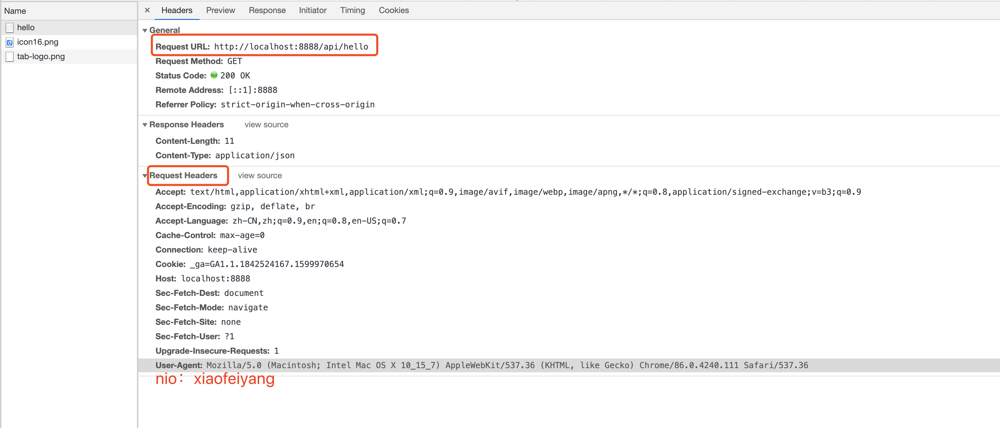
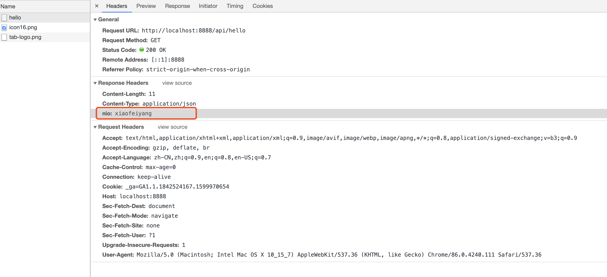

第一份作业请见项目nio02-first
=======

添加了`OkhttpOutboundHandler`内容

修改了`HttpInboundHandler`使用的handler

# 第三份作业是在第一份作业的基础上修改的

添加了`MyHttpRequestFilter`以实现添加{"nio":"xiaofeiyang"}请求头的功能

在`HttpInboundHandler` channelRead方法中，添加了filter

在`OkhttpOutboundHandler`中获取了请求头内容，并将请求头内容作为另一个请求头发起

## 收获：

```
解决了一个疑问，
在chrome中，访问http://localhost:8888/api/hello中的network查看请求头时，没有nio这项，算成功么？
// 经过群友的解答，发现了问题，我在chrome里看到的请求头，是chrome为我添加好的，我在网关中添加的请求，在chrome肯定是看不见的，但是我可以
// 把请求里的东西拿出来，放入response中
```





学习笔记

### 什么是高性能？

高并发用户（日活用户数量、同时在线的用户数量）、高吞吐量、低延迟

### 延迟是针对系统的，响应时间是针对客户或调用系统的

### P99 百分之99的请求的响应时间是多少

### 高性能的副作用

1. 复杂度10倍增长、建设和维护成本++++、故障和bug导致的损失10倍增长

### 目前国内最大的并发量：

双十一的第一分钟内支付宝50万TPS，所有电商都需要用支付宝支付

### 为什么会有多线程？

因为硬件的发展。以前的硬件体积像房子，编程靠纸袋，那种时代的计算机不需要现代计算机模型。intel创始人摩尔，提出集成电路每隔24个月，晶体管数量会增加一倍。

### Thread.sleep意味着什么？

静态方法，状态进入TIMED_WAITING，不释放对象锁，作用：不再占用CPU的时间片，给了其他线程占用CPU的机会。

### Thread.yield()意味着什么？

让线程的状态从running再成为runnable，一般很少用。

### t.join()/t.join(time)意味着什么？

线程实例的方法，等待t线程完成任务，进入就绪的状态~~但是不会释放当前对象的锁，会释放t的锁~~

### obj.wait()意味着什么？

任意对象的方法，释放对象的锁，进入等待状态，依靠notify唤醒或者定时唤醒

### Obj.notify()意味着什么？


线程状态RMB oh no RWB，2R2W1B，Run Ready Wait Time-wait Block

### 多线程执行的时候会遇到什么问题？

 多个人抢一个对象。如果是线程内部的局部变量就没有竞争问题，因为没人跟他抢。

### 锁的最佳实践

尽可能的让锁的粒度最小，方法块>this>代码块

### final

可以添加在每个方法中的参数中，作为编码规范使用

### 建立线程池的方法1：（分配参数）

1. 创建线程直到数量到达核心线程数

2. 把任务加进worker队列中

3. 如果队列满了，就再建线程，非核心的 

4. #### 为什么不是先扩充到最大线程数再用队列呢？

   1. 因为CPU的资源十分有限，如果任务来了就建线程，建到满，CPU在各个线程之间来回切换，反而效率会低
   2. 第二种场景，如果来了IO密集型的任务，队列起到了缓冲的作用

### 建立线程池方法2:（使用已经创建好的模型，有4种）

1. 单线程
2. 固定线程数量（坑点：队列的大小不限制）
3. 带缓存的线程池（坑点：线程数量不限制）
4. 可调度的线程池

### 固定线程池的最佳实践

1. CPU密集型的应用，线程数N或N+1
2. IO密集型的应用，线程数2N或2N+2 （IO的等待时间，CPU可切换到其他线程运行，增加效率）